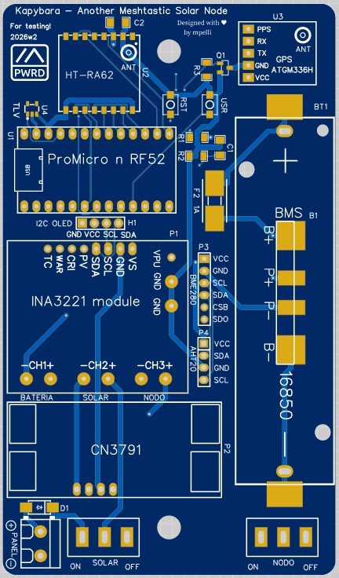
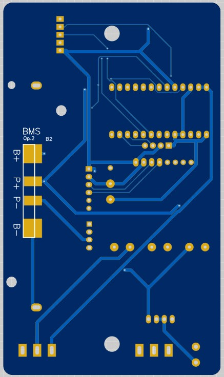
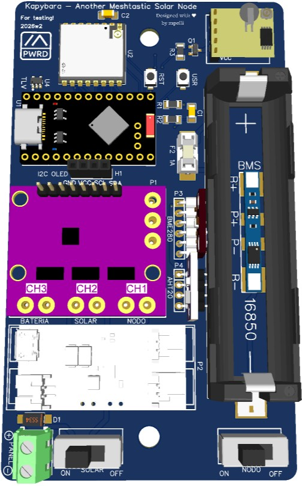
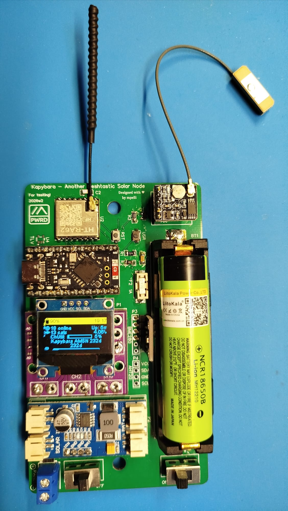
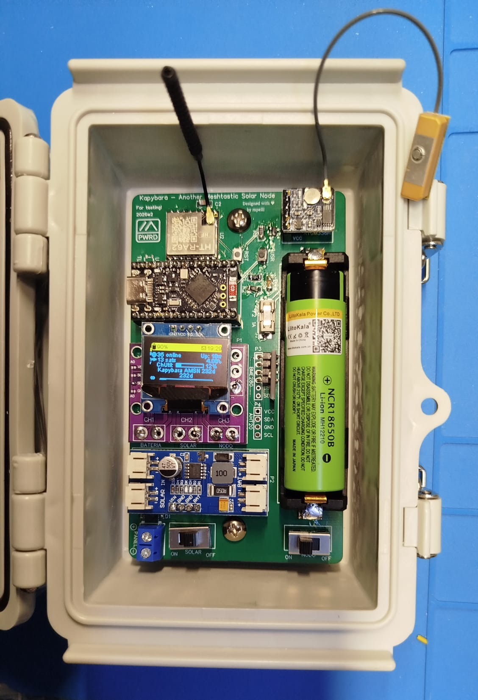
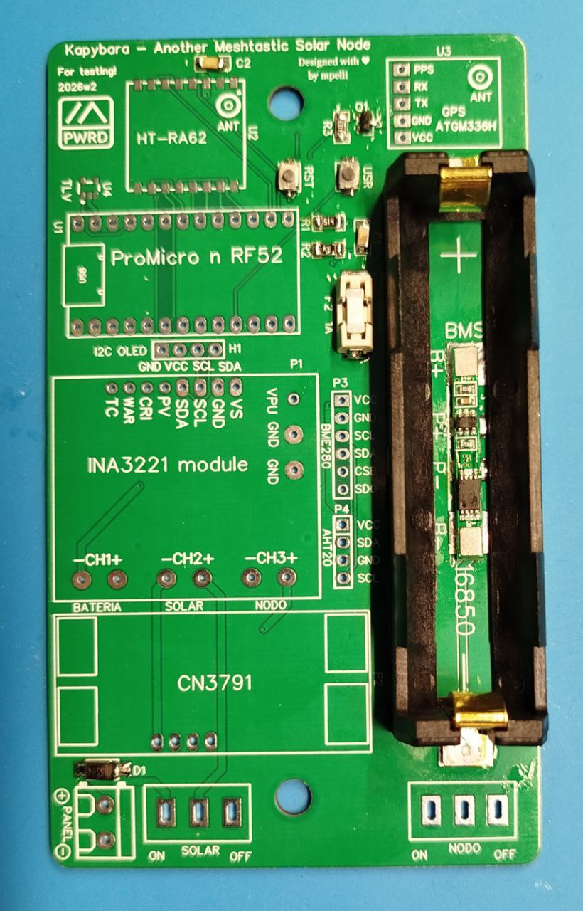
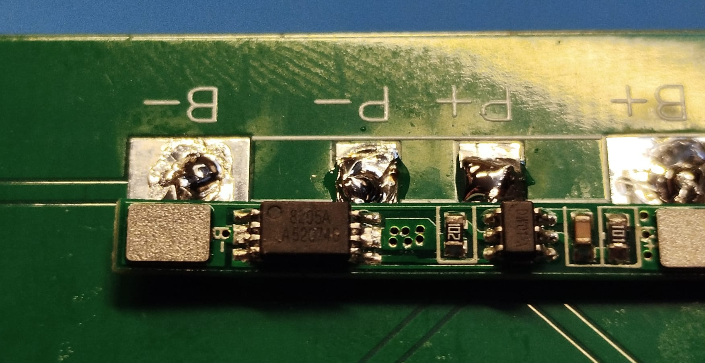
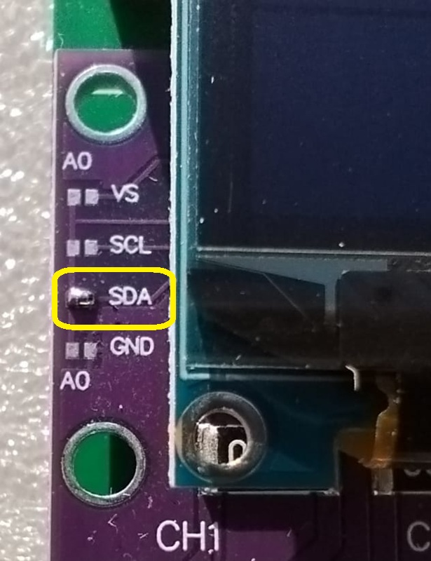
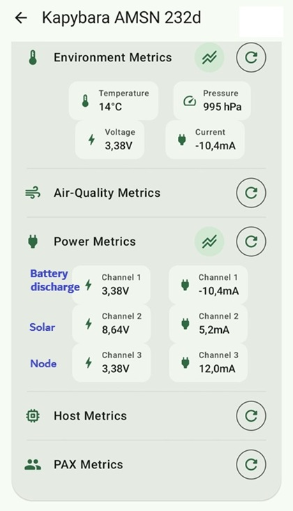
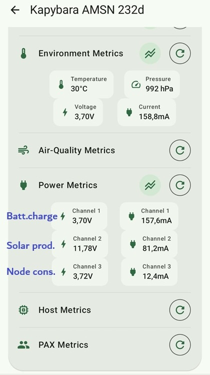

# Kapybara-PCB for Meshtastic
Modular printed circuit board designed for Meshtastic projects, measuring 120 x 70 mm, for assembly as a standalone solar node in an outdoor enclosure (AliExpress box). Many modules are optional, at the user's choice.

## Description

Modular PCB designed for Meshtastic projects, 120 x 70 mm, for mounting as a standalone solar node in an outdoor enclosure (AliExpress item 1005007587120013). Many modules are optional, according to user needs.

**Basic System**
- MCU: ProMicro Nice!nano compatible with nRF52840.
- LoRa Module: HT-RA62 Lora SX1262.
- Battery Charge Control: CN3791 6V MPPT solar.
- Battery: 18650 with PCB holder, SMD or THT options.
- BMS: Two options: a) Front PCB (if battery holder allows), b) Back PCB.
- AliExpress Case: Item 1005007587120013 [AE Grey Box Model 150x100x70](https://aliexpress.com/item/1005007587120013.html).
- Solar Panel: Use a 6V panel with at least 1.5W. I am using a [17.4 x 12 cm solar panel](https://es.aliexpress.com/item/1005009983374214.html) from AliExpress.

**Optional Components**
- Power: SMD Fuse for power supply protection, with SMD fuse holder.
- Battery Percentage: R1+R2 for battery voltage measurement by the MCU ADC.
- Filtering: Capacitors C1 and C2 are not strictly necessary, but space is reserved on the PCB in case supply voltage filtering is needed.
- Power Telemetry: INA3221 3-channel current and voltage meter.
- Battery Voltage Supervision: TLV840 to reset the MCU in case of undervoltage and mitigate brownout effects.
- Environmental Telemetry: Temperature, humidity, and pressure sensors; two options: a) BME280 3.3V b) AHT20-BMP280.
- GPS Module: ATGM336H for node time synchronization, with MOSFET control (N-channel).
- OLED Display: Female connector for, e.g., SSD1306.

## 🚦 Project Status

| Function / Module | Status | Notes |
| :--- | :---: | :--- |
| **Battery Power (3.7V)** | 🟢 OK | BMS Ok. |
| **Power Supply (3.3V)** | 🟢 OK | Tested indirectly via sensors Ok. |
| **nRF52840** | 🟢 OK | Bootloader flashed and firmware loaded, BLE Ok. |
| **LoRa (HT-RA62)** | 🟢 OK | TX/RX tests Ok. |
| **CN3791** | 🟢 OK | Battery charging via solar panel Ok. |
| **BME280** | 🟢 OK | Environmental readings Ok in App. |
| **INA3221** | 🟢 OK | Electrical readings Ok in App. |
| **AHT20-BMP280** | ⚪ PEND. | Testing pending. No surprises expected. |
| **ATGM336H** | 🟢 OK | GPS reading Ok with AO3400 MOSFET ctrl. |
| **TLV840** | 🔴 NOK | Supervisor design needs to be reconsidered. |

**Legend:**
🟢 `Tested & Working` | 🔴 `Failed / Redesign` | 🟡 `Work in Progress` | ⚪ `Pending Testing`

### 🖼️ Image Gallery

**📸 PCB**

| Front View | Back View |
| :---: | :---: |
|  |  |

## 📄 Schematic

*Click on the image to open the PDF*

**📸 Assembly**

| 3D View | PCB | Case |
| :---: | :---: | :---: |
|  |  |  |

| BMS Front| PCB Back | INA SDA jumper |
| :---: | :---: | :---: |
|  |  |  |

|APP INA channels  bat.discharge | APP INA channels battery charge |
| :---: | :---: |
|  |  |

## How to order the PCB

You can order the PCBs directly at [JLCPCB](https://jlcpcb.com/) or any other manufacturer using the Gerber file from this repository:
[v0 Gerber PCB for testing](Gerbers/Gerber_Kapybara_PCB_AMSN_v0_2026-01-11.zip)

## Bill of Materials (BOM)

There is no affiliation with the links provided. They are provided as examples to facilitate component selection.

*Approx. Total (as of Feb 2026) = €23*

| Part | Qty. | Cost | Link | Notes |
|-------|-------|-------|--------|-----------|
|ProMicro nRF52840|1|€2.7|[Op1](https://es.aliexpress.com/item/1005006271881076.html)|[Op2](https://es.aliexpress.com/item/1005007738886550.html)|
|HT-RA62|1|€5.5|[Op1](https://es.aliexpress.com/item/1005008363549136.html)|[Op2](https://es.aliexpress.com/item/1005008626582098.html)|
|CN-3791|1|€2.3|[Op1](https://es.aliexpress.com/item/1005007355378997.html)|6V or 12V depending on solar panel|
|INA3221|1|€1.3|[Op1](https://es.aliexpress.com/item/1005007723353245.html)|Check order CH1, CH2, CH3 from left to right|
|BME280-3.3|1|€2.5|[Op1](https://es.aliexpress.com/item/1005004527984343.html)|Note: BME= P&T&H; BMP= P&T|
|AHT20 + BMP280|1|€1.2|[Op1](https://es.aliexpress.com/item/1005007702473893.html)|Alternative to BME|
|BMS|1|€0.17|[Op1](https://es.aliexpress.com/item/1005005968623999.html)|Pack of 10 units|
|GPS ATGM336H|1|€5.9|[Op1](https://es.aliexpress.com/item/4001147538089.html)||
|MosFet AO3400|1|€0.02|[Op1](https://es.aliexpress.com/item/1005006142488372.html)|Or N-channel equiv.; 100 units|
|TLV840|1|€0.78|[Op1](https://es.aliexpress.com/item/1005010444348808.html)|TLV840MADL30DBVRQ1; 10 units|
|Batt. Holder|1|€0.95|[Op1 SMD](https://es.aliexpress.com/item/1005005301516019.html)|[Op2 THT](https://es.aliexpress.com/item/1005007051308086.html)|
|SMD Button|2|€0.04|[Op1](https://es.aliexpress.com/item/4001125532910.html)|100 units|
|Terminal Block|1|€0.29|[Op1](https://es.aliexpress.com/item/1005003556955422.html)|2 pin 5 units|
|Fuse|1|€0.12|[Op1](https://es.aliexpress.com/item/1005002366334753.html)|1A 10 units|
|Fuse Holder|1|€0.14| "  " |1808 Socket 10 units|
|Resistors|3|€0.03|[Op1](https://es.aliexpress.com/item/1005006044241818.html)|1206 pack|
|Capacitors|2|€0.03|[Op1](https://es.aliexpress.com/item/1005002528281793.html)|1206 100nF 100 units|
|Diode|1|€0.02|[Op1](https://es.aliexpress.com/item/1005009947560623.html)|SS34 SMA 50 units|
|Female Headers|x|€0.15|[Op1](https://es.aliexpress.com/item/1005003406780797.html)|1X13Pin 10 units|

## 🛠 Assembly Instructions

Follow these steps to assemble your Kapybara-PCB:

⚠️ Never power the node without an antenna connected. You may damage the LoRa module.
- Verify that the microcontroller is functional:
- Update its bootloader to version 0.8 or higher if necessary. [Bootloader 0.9.2](https://github.com/adafruit/Adafruit_nRF52_Bootloader/releases/download/0.9.2/update-nice_nano_bootloader-0.9.2_nosd.uf2)
- Install the [Meshtastic firmware](https://flasher.meshtastic.org)

It is assumed you have some experience soldering electronic components.
1. Solder small SMD components first, such as resistors, capacitors, buttons, MOSFET, and TLV.
2. Solder the microcontroller and the LoRa module next. Ensure the orientation is correct according to the silk screen.
3. Connect the antenna (a small one is sufficient temporarily) and power the MCU via the USB port.
4. Verify the node starts correctly, that you can connect via BLE from your phone, and that it can send/receive messages.
5. If all the above is correct, proceed with the assembly.
6. Solder the fuse holder and fuse, or bridge the fuse pads if you are not using one.
7. Solder the BMS, battery holder, and switches.
8. Solder the INA3221 or, if not using it, bridge the (+) and (-) pads of each channel to continue the series and provide continuity.
9. If using INA3221, remember to solder the pads marked as SDA on the left side so it is recognized by the firmware.
10. Ensure the node is not powered via USB. Insert the 18650 battery and turn the power switch to "ON".
11. Repeat step 4. Measure Vcc voltages, which should be approx. 3.3V. Turn off the node and remove the battery.
12. Continue assembly. Solder the MPPT CN3791. If you haven't mounted diode D1, bridge it.
13. Connect the solar panel to its terminal block, check its operation and that it charges the battery. Turn off the node and remove the battery.
14. Solder the environmental sensors module and check its operation. Turn off the node and remove the battery.
15. Solder the rest of the optional components and check their operation. For the GPS and Display, you can use female headers or cut pin strips as needed.
16. If using GPS, remember to configure the following GPIOs in the App: RX= 20, TX= 22, EN= 24
17. Measure the battery voltage and adjust the "ADC Multiplier override" value in the App (initially set to 1.551) so it matches the App reading.

## 📋 Node configuration
- Follow the Getting Started guide, where you can find the [basic node configuration](https://meshtastic.es/docs/primeros-pasos/#configurar-tu-dispositivo)
- Remember to adjust the "ADC Multiplier override" appropriately and assign the corresponding GPIOs to the GPS.
- You can get help and resolve your doubts in the [Meshtastic Spain group Telegram](https://t.me/meshtastic_esp) or find your local group in the following [list](https://meshtastic.org/docs/community/local-groups/).

## Legal Disclaimer
- [Meshtastic](https://meshtastic.org/) software components are released under various licenses. See [GitHub](https://github.com/meshtastic) for more info.
- No warranty is offered; use this design at your own risk.
- Meshtastic® is a registered trademark of Meshtastic LLC.
- This site is not affiliated with or endorsed by the Meshtastic project.

## License

This project is licensed under the **CERN Open Hardware Licence Version 2 - Strongly Reciprocal (CERN-OHL-S)**.

### What does this mean?
- **Share:** You can download, modify, and manufacture this PCB.
- **Attribution:** You must give appropriate credit to the original author (mpelli-Git).
- **Reciprocity:** If you make modifications or improvements to the design and distribute them, you **must** license your contributions under the same CERN-OHL-S license. This ensures the entire community benefits from the improvements.

You can find the full license text in the [LICENSE](LICENSE) file or visit [https://ohwr.org/cern_ohl_s_v2.txt](https://ohwr.org/cern_ohl_s_v2.txt) for more details.

[⬅️ Back to main menu](README.md)
